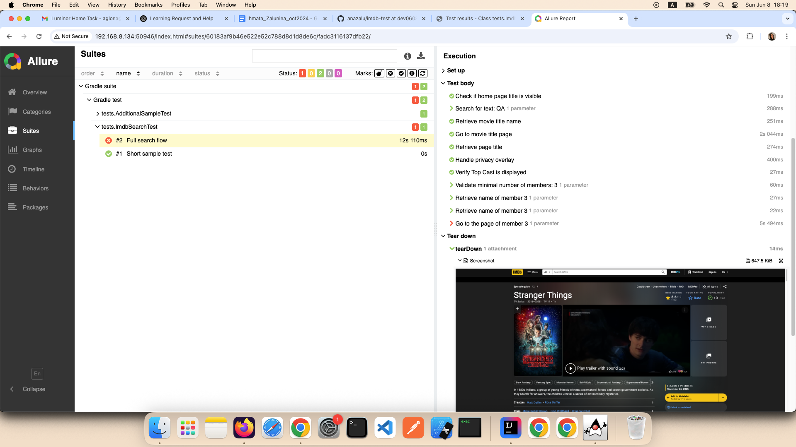

# Home Task
Automated test case (search on IMDB) with generated test report.

## Tech stack
Gradle, Selenide, Java 17, TestNG, Allure Report

## Run tests

-- Run all tests:
```
./gradlew clean test
```

-- Generate the Allure report:
```
./gradlew allureReport
```        

-- Serve the report locally:
```
./gradlew allureServe
```

## Reports
